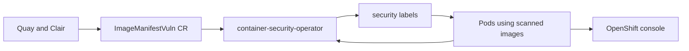

# container-security-operator Architecture

## Purpose

Display Clair vulnerability scan results in OpenShift web console.



## High-Level Design

```
Clair/Quay (creates ImageManifestVuln CRs)
    ↓
container-security-operator (watches CRs + Pods)
    ↓ Labels pods with vuln info
OpenShift Console (displays security tab)
```

## Components

### `/apis/secscan/v1alpha1`
CRD definitions:
- `ImageManifestVuln`: Vulnerability data for image manifest
  - Severity (Critical, High, Medium, Low)
  - CVE details
  - Affected packages

### `/cmd/manager`
Operator entrypoint:
- Controller manager
- Watches ImageManifestVuln + Pod resources

### `/labeller`
Pod labeling logic:
- Matches Pods to ImageManifestVuln by image digest
- Adds labels: `secscan/hasVulnerabilities`, `secscan/highestSeverity`
- Updates labels on vuln changes

### `/k8sutils`
Kubernetes client helpers:
- Pod queries
- Label updates
- Event recording

## Data Flow

```
1. Quay/Clair scans image → creates ImageManifestVuln CR:
   apiVersion: secscan.quay.redhat.com/v1alpha1
   kind: ImageManifestVuln
   metadata:
     name: sha256-abc123...
   spec:
     image: quay.io/org/app@sha256:abc123
     manifest: sha256:abc123
     features:
       - name: curl
         version: 7.68.0
         vulnerabilities:
           - name: CVE-2023-1234
             severity: High
             fixedBy: 7.68.1

2. operator watches ImageManifestVuln creation

3. operator queries Pods using image sha256:abc123

4. operator labels matching Pods:
   secscan/hasVulnerabilities: "true"
   secscan/highestSeverity: "High"
   secscan/affectedByVulns: "CVE-2023-1234,CVE-2023-5678"

5. OpenShift console reads labels → displays in Security tab
```

## Labeling Strategy

Pod labels:
- `secscan/hasVulnerabilities`: "true" | "false"
- `secscan/highestSeverity`: "Critical" | "High" | "Medium" | "Low"
- `secscan/affectedByVulns`: comma-separated CVE list (truncated if >63 chars)

## Reconciliation

```
Watch ImageManifestVuln:
  On create/update:
    - Extract image digest
    - Find Pods with matching image
    - Calculate highest severity
    - Apply labels

Watch Pods:
  On create:
    - Extract image digest
    - Find ImageManifestVuln for digest
    - Apply labels if vulns exist
```

## Performance

- Indexer for image digest → ImageManifestVuln mapping
- Batch label updates (multiple pods with same image)
- No polling (watch-based)

## OpenShift Integration

Console plugin displays:
- Vulnerability count by severity
- CVE details with links to NVD
- Affected packages + fixed versions
- Drill-down from workload → vulns
